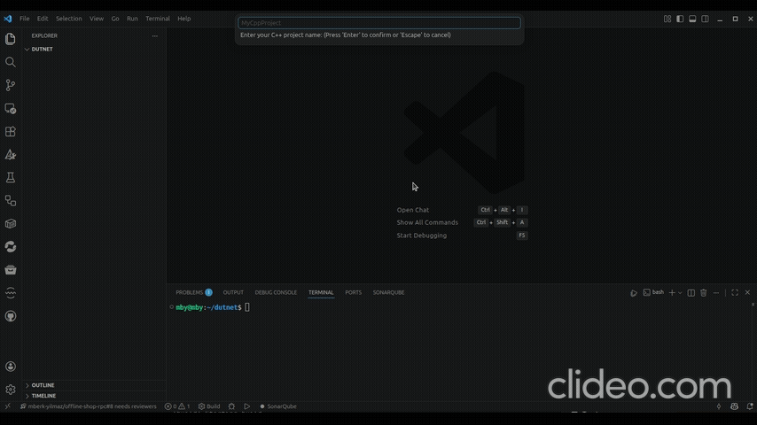

# C++ Configurator

A Visual Studio Code extension that automatically generates a comprehensive, production-ready C++ workspace environment. This extension eliminates the boilerplate setup required for professional C++ development by properly initializing CMake, IntelliSense, formatters, and testing frameworks.

## Demo



## Features

- **Automated Workspace Setup:** Generates a standardized directory structure (`src/`, `include/`, `tests/`, etc.).
- **CMake & Build System:** Generates `CMakeLists.txt` and `CMakePresets.json` with presets for Debug, Release, and Sanitizers (ASAN/TSAN/UBSAN).
- **IntelliSense Configuration:** Properly configures VS Code's `settings.json`, `c_cpp_properties.json` and `.clangd` to fully understand your workspace, including dynamically injected `compile_commands.json` support so dependencies are seamlessly resolved.
- **Code Quality Tools:** Bundles pre-configured `.clang-format` and `.clang-tidy` files tailored for modern C++ development, along with Python scripts to easily execute them across the entire workspace.
- **Test Framework Integration:** Supports automatically setting up GoogleTest (GTest) or Catch2 via CMake's FetchContent mechanism.
- **Premium Debugging:** Multi-profile `launch.json` setup for GDB and CodeLLDB, including dedicated test debugging setups out of the box.
- **Package Manager Configuration:** Provisions initial configuration for `vcpkg` (`vcpkg.json`) or `Conan` (`conanfile.txt`) based on user selection.
- **Continuous Integration:** Generates a GitHub Actions workflow for cross-platform builds out of the box.

## Requirements

Ensure you have the following installed on your system to fully utilize the generated workspace:
- CMake (3.14 or higher)
- Optional: Python 3 (to run formatting/linting scripts)
- Extensions: It is highly recommended to use either the **C/C++** (Microsoft) or **clangd** extension for intelligent code completion.

## Usage

1. Open an empty folder in VS Code.
2. Open the Command Palette (`Ctrl+Shift+P` on Windows/Linux, `Cmd+Shift+P` on macOS).
3. Type **C++ Configurator: Initialize Workspace** and press Enter.
4. Follow the interactive prompts to define:
   - Project Name
   - C++ Standard (c++17, c++20, c++23)
   - Compiler Path (auto-detected from your system PATH)
   - Testing Framework (None, GTest, Catch2)
   - Package Manager (None, vcpkg, Conan)

Once finished, the extension will generate all necessary configuration files, build scripts, and source files. You can start writing code immediately or build the project using VS Code tasks or the terminal.

## Workspace Structure

The extension generates the following standardized layout:

```text
.
├── .github/
│   └── workflows/
│       └── build.yml
├── .vscode/
│   ├── c_cpp_properties.json
│   ├── extensions.json
│   ├── launch.json
│   ├── settings.json
│   └── tasks.json
├── cmake/
│   ├── CompilerOptions.cmake
│   ├── FetchTests.cmake
│   ├── Options.cmake
│   ├── Sanitizers.cmake
│   └── Warnings.cmake
├── include/
├── src/
│   ├── CMakeLists.txt
│   └── main.cpp
├── tests/
├── tools/
│   ├── run-clang-format.py
│   └── run-clang-tidy.py
├── .clang-format
├── .clang-tidy
├── .clangd
├── .editorconfig
├── .gitattributes
├── .gitignore
├── CMakeLists.txt
├── CMakePresets.json
└── Doxyfile
```
